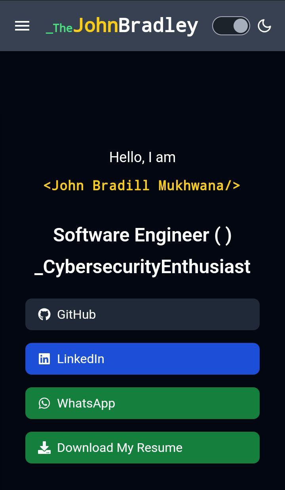
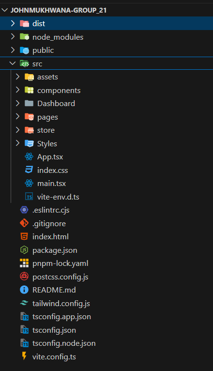

# JohnMukhwana-Group_21 :rocket:
<br>

--

A personal portfolio website showcasing skills, projects, and professional achievements. This site highlights my expertise in fullstack development, software engineering, and other technical proficiencies.




---
## 📜 Table of Contents  
1. [✨ Introduction](#-introduction)  
2. [🎨 Features](#-features)  
3. [🛠️ Technologies Used](#%EF%B8%8F-technologies-used)  
4. [📂 Folder Structure](#-folder-structure)  
5. [⚙️ Installation & Setup](#%EF%B8%8F-installation--setup)  
6. [📖 Usage](#-usage)  
7. [🚀 Live Demo](#-live-demo)  
8. [🤝 Contributing](#-contributing)  
9. [📜 License](#-license)  
10. [🙏 Acknowledgements](#-acknowledgements)


---

## ✨ Introduction  

Hi there! 👋 I'm **John Bradill Mukhwana**, a **Fullstack Developer** and **Software Engineering Student at Kirinyaga University**.  

This portfolio is a reflection of my:  
- 💡 Creative vision.  
- 🛠️ Expertise in **Web Development** and **Cybersecurity**.  
- 🔍 Passion for solving real-world problems through technology. 
- Showcase personal and professional projects.
- Provide a brief biography and skills summary.
- Act as a medium for contact and networking. 

🔗 Explore projects, blogs, and resources that highlight my journey in **software engineering**, **blog writing**, and **community mentorship**.  

  

<br>

---
## 🎨 Features  
✅ **Theme Changer**: you can view it in dark mode or light mode
✅ **Dynamic User Dashboard**: with easy navigation.  
✅ **Blog Cards with Hover Effects**: to explore my technical writings.  
✅ **Responsive Design**: for all screen sizes.  
✅ **Interactive Components**: for a seamless user experience.  
✅ **Community Features**: for user engagement. 
✅ **Interactive UI**: Engaging animations and navigations.
✅ **Projects Section**: Highlights recent work with detailed descriptions.
✅ **Rating Section**  :For giving me feedback about my portfolio 
✅ **Contact Form**: A functional form to reach out directly. 


---

## 🛠️ Technologies Used  

### **Frontend**  
- 🖼️ **ReactJS** with **TypeScript**  
- 🎨 **Tailwind CSS** for beautiful, responsive designs  

### **Backend**  
- ⚙️ **Node.js** with **Typescript**
- 📊 **Hono.js** for server

### **Database**  
- 🗄️ **Postgresql** 
- 🗄️ **supabase** 


### **Others**  
- 🔐 Postman for testing
- 🌐 Vercel for deployment  

---
### 📂 Folder Structure  

Here's how the project is organized: <br>


---

### ⚙️ Installation & Setup

**Prerequisites**
Make sure you have these installed:<br>

-Node.js v14+<br>
-npm or yarn<br>
-pnpm

--
1. Clone the repository:
    ```bash
    git clone https://github.com/your-username/portfolio.git
    ```
2. Navigate to the project directory:
    ```bash
    cd portfolio
    ```
3. Install dependencies:
    ```bash
    npm install
    ```

---
## 📖 Usage

---
## 🚀 Live Demo
---
## 🤝 Contributing
---
## Author
---
## 🙏 Acknowledgements
---
## 🔥 Demo Images
---
## 🌟 Let's Connect
💼 [Linkedin]() 
📧 Email: johnbradill@example.com
🌐 Blog: Tech Checkmate
---
 
