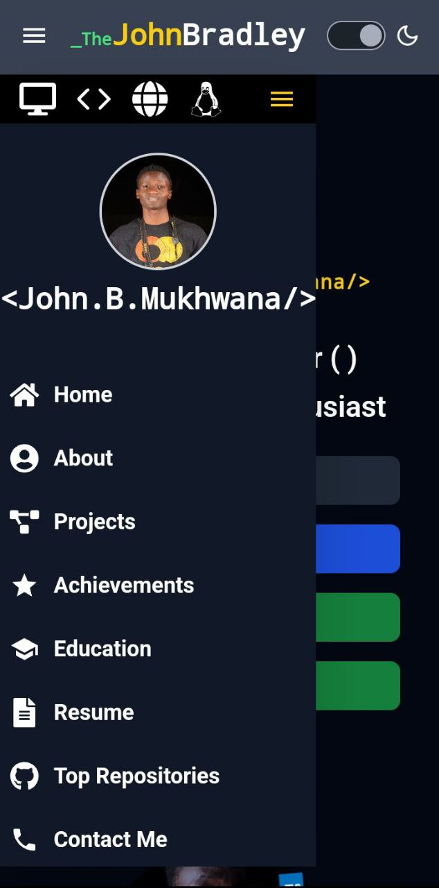
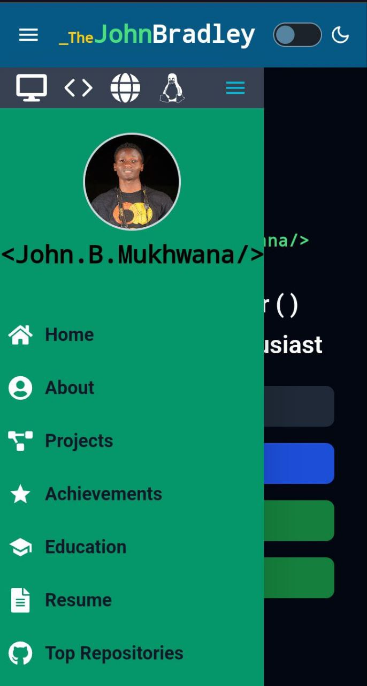
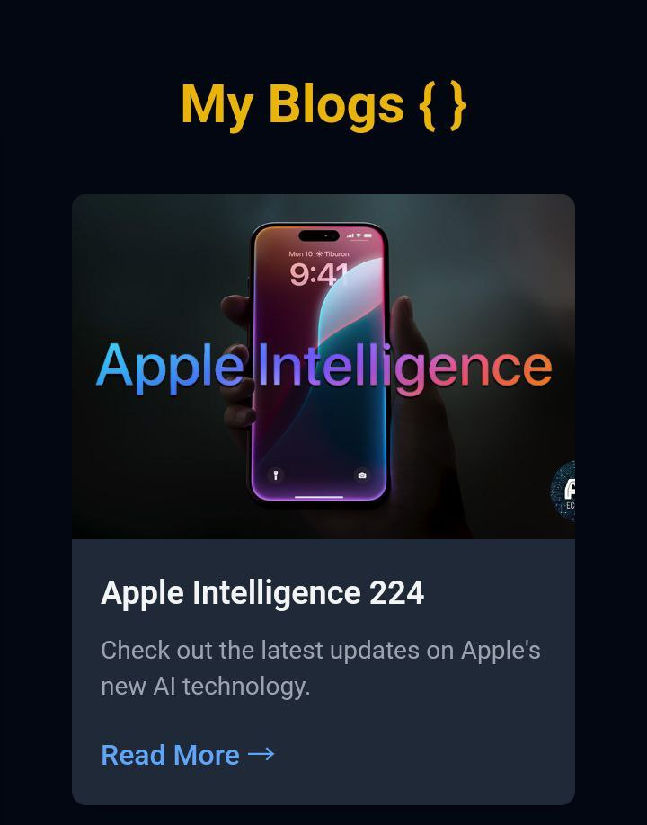
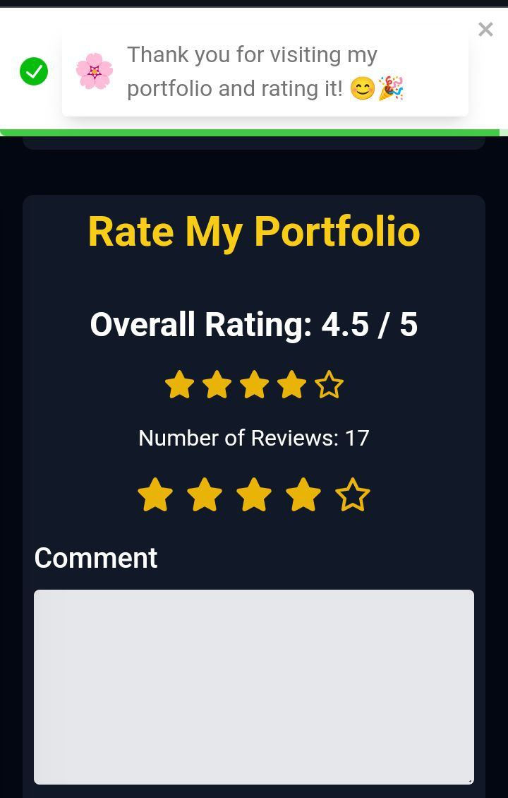
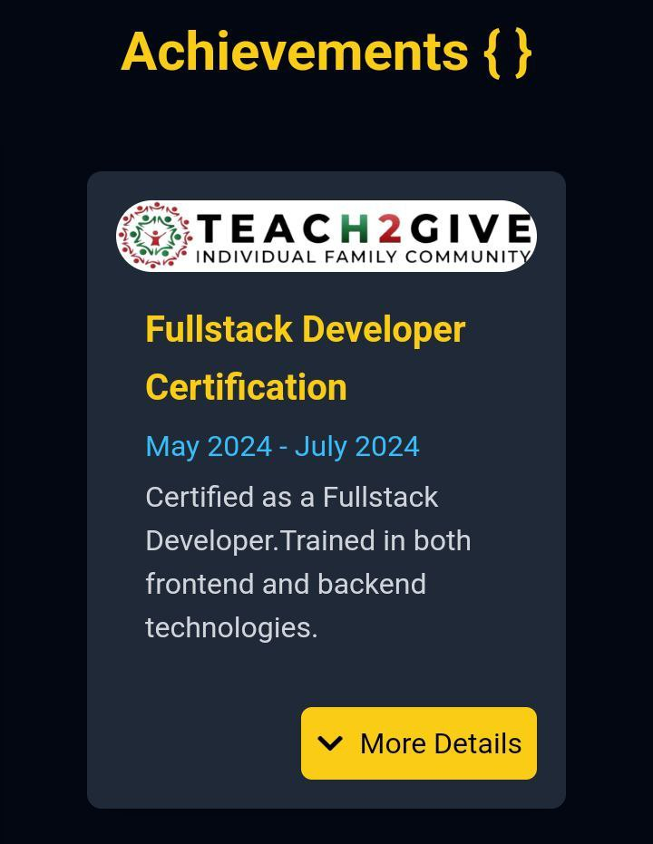

# JohnMukhwana-Group_21 :rocket:
<br>


A personal portfolio website showcasing skills, projects, and professional achievements. This site highlights my expertise in fullstack development, software engineering, and other technical proficiencies.


---
## 📜 Table of Contents  
1. [✨ Introduction](#-introduction)  
2. [🎨 Features](#-features)  
3. [🛠️ Technologies Used](#%EF%B8%8F-technologies-used)  
4. [📂 Folder Structure](#-folder-structure)  
5. [⚙️ Installation & Setup](#%EF%B8%8F-installation--setup)  
6. [📖 Usage](#-usage)  
7. [🚀 Live Demo](#-live-demo)  
8. [🤝 Contributing](#-contributing)   
9. [🙏 Acknowledgements](#-acknowledgements) 
10. [💥 Demo Images ](#-demo-images)  
11. [🕵️‍♂️ Author](#-authors)  


---

## ✨ Introduction  

Hi there! 👋 I'm **John Bradill Mukhwana**, a **Fullstack Developer** and **Software Engineering Student at Kirinyaga University**.  

This portfolio is a reflection of my:  
- 💡 Creative vision.  
- 🛠️ Expertise in **Web Development** and **Cybersecurity**.  
- 🔍 Passion for solving real-world problems through technology. 
- Showcase personal and professional projects.
- Provide a brief biography and skills summary.
- Act as a medium for contact and networking. 

🔗 Explore projects, blogs, and resources that highlight my journey in **software engineering**, **blog writing**, and **community mentorship**.  


<br>

---
## 🎨 Features  
✅ **Theme Changer:** you can view it in dark mode or light mode<br>
✅ **Dynamic User Dashboard:** with easy navigation.  
✅ **Blog Cards with Hover Effects:** to explore my technical writings.  
✅ **Responsive Design:** for all screen sizes.  
✅ **Interactive Components:** for a seamless user experience.  
✅ **Community Features:** for user engagement. 
✅ **Interactive UI:** Engaging animations and navigations.<br>
✅ **Projects Section:** Highlights recent work with detailed descriptions.<br>
✅ **Rating Section:** For giving me feedback about my portfolio<br>
✅ **Contact Form:** A functional form to reach out directly. <br>

*Screenshot for Responsivenessof My portfolio*
   
<br>

---

## 🛠️ Technologies Used  

### **Frontend**  
- 🖼️ **ReactJS** with **TypeScript**  
- 🎨 **Tailwind CSS** for beautiful, responsive designs  

### **Backend**  
- ⚙️ **Node.js** with **Typescript**
- 📊 **Hono.js** for server

### **Database**  
- 🗄️ **Postgresql** 
- 🗄️ **supabase** 


### **Others**  
- 🔐 Postman for testing
- 🌐 Vercel for deployment  

---
### 📂 Folder Structure  

Here's how the project is organized: <br>


---

### ⚙️ Installation & Setup

**Prerequisites** 
Make sure you have these installed:<br>

- Node.js v14+<br>
- npm or yarn<br>
- pnpm


1. Clone the repository:
    ```bash
    git clone https://github.com/John-Mukhwana/JohnMukhwana-Group_21.git
    ```
2. Navigate to the project directory:
    ```bash
    cd JohnMkhwana-Group_21
    ```
3. Install dependencies:
    ```bash
    pnpm install 
    ```

---
## 📖 Usage  

1. Run the development server:
    ```bash
    pnpm run dev
    ```
2. Open the site in your browser at:
    ```
    http://localhost:3000
    ```

*For production:*
```bash
pnpm run build
```

---

## 🚀 Live Demo
Exprience the portfolio live at:  
[](https://your-live-demo-link.com)

---
## 🤝 Contributing
I welcome contributions! 🌟  
But before contributing contact me first

1. Fork the repository:
   - Navigate to the repository on GitHub and click the **Fork** button.

2. Clone the repository:  

   ```bash
   git clone https://github.com/John-Mukhwana/JohnMukhwana-Group_21.git
   cd JohnMukhwana-Group_21
   ```
---

## 🙏 Acknowledgements  

- ❤️ **Thanks to Myself ** for the inspiration and support.  
- 🌟 Designed with **love, creativity, and dedication** to craft an impactful user experience.  
- 🛠️ Built using **modern web technologies** to ensure scalability and performance.  
- 💡 Special thanks to **mentors, peers, and contributors** for their guidance and feedback.  
- 🌍 Grateful for the **open-source community** for providing incredible tools and resources.

---
## 🔥 Demo Images  
🔍 Check out the live demo of the project:

  

  



---  

## 🕵️‍♂️ Author  

**John Bradill Mukwana**

[](https://github.com/John-Mukhwana)  

[](https://john-bradill-portfolio-black.vercel.app/)  

[](https://www.linkedin.com/in/your-link) 

[](mailto:your-email@example.com)


Feel free to reach out for collaboration or inquiries!

---
 
